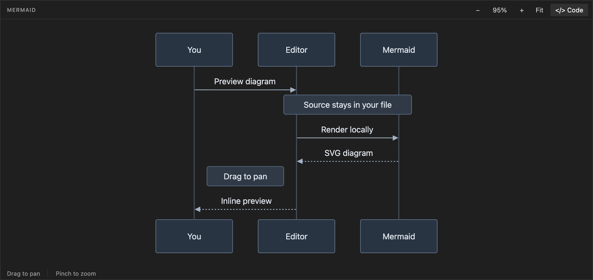

# Mermaid Inline — experimental VS Code extension

Render Mermaid diagrams **inside the native text editor**, at the position of a
Markdown fence or a standalone `.mmd` / `.mermaid` file. Each diagram has a
**Code** button that restores its editable source.

## See it in action

A 53-second showcase of inline diagrams, source toggling, panning and zooming,
and standalone Mermaid files.

https://github.com/user-attachments/assets/33dfca7d-05c7-4cd3-847d-99b628cd2ec9

This is a working prototype using VS Code's **proposed `editorInsets` API**.
It inserts a webview after the first source line and folds the remaining lines.
**The opening fence / first source line stays visible.** VS Code does not expose
an API here that completely replaces a text range with a renderer.

## Try it

Download the installable VSIX from [GitHub Releases](https://github.com/201549BL/mermaid-inline/releases).
Choose `mermaid-inline-0.2.1.vsix`, not GitHub's source-code ZIP. Each release
includes a `SHA256SUMS.txt` file for verifying the download.

### Run from source

1. Open this folder in VS Code 1.134 or later.
2. If dependencies are missing, run `npm ci` (Node.js 24 recommended).
3. Press **F5**, selecting **Run Mermaid Inline** if prompted.
4. In the Extension Development Host window, open `examples/diagrams.md`.
5. Click **Preview Mermaid diagram** above a fence. Click **Code** inside the
   resulting diagram to edit it again.

The launch configuration enables `editorInsets` for this development extension.
The prototype was tested against the installed VS Code **1.134.0 on macOS ARM64**.
Proposed APIs can change; VS Code Insiders is Microsoft's documented environment
for experimenting with them.

### Install the VSIX locally

Use **Extensions → … → Install from VSIX…**, and select the downloaded VSIX. Start
VS Code with the proposed API explicitly enabled:

```sh
code --enable-proposed-api=201549bl.mermaid-inline
```

If a VS Code instance is already running without the flag, fully quit it first
or use a separate `--user-data-dir` for the experimental instance. With Insiders,
use `code-insiders` in place of `code`.

The extension ID is `201549bl.mermaid-inline`. Early local prototypes used
`local-prototypes.mermaid-inline`; uninstall that prototype if you installed it,
so both versions do not add controls to the same editor.

To avoid typing the flag each time, use **Preferences: Configure Runtime
Arguments** in VS Code and add this entry to the existing JSON object, preserving
any other settings:

```json
"enable-proposed-api": ["201549bl.mermaid-inline"]
```

Fully quit and reopen VS Code after changing runtime arguments. For new releases,
download the new VSIX and use **Install from VSIX…** again; GitHub distribution
does not provide Marketplace automatic updates.
**Do not publish this prototype to the Marketplace:** it depends on an unstable
API. See [Microsoft's proposed API documentation](https://code.visualstudio.com/api/advanced-topics/using-proposed-api).

## Controls

| Action | Control |
| --- | --- |
| Toggle the block at the cursor | **⌘⌥M** on macOS; **Ctrl+Alt+M** elsewhere |
| Preview one block | **Preview Mermaid diagram** above its opening fence |
| Return to source | **Code** in the diagram, **Esc** while it has focus, or its source CodeLens |
| Render the whole document | **Mermaid Inline: Preview All Diagrams** in the Command Palette |
| Restore every source block | **Mermaid Inline: Show All Source Code** in the Command Palette |
| Pan a large diagram | Drag the diagram, or scroll with a mouse/trackpad; Shift+scroll pans horizontally |
| Zoom around the pointer | Pinch the trackpad, or **Ctrl/⌘ + scroll** |
| Zoom around the center | **−** and **+** buttons |
| Reset the view | **Fit** recenters the whole diagram; click the zoom percentage for **100%** |

With the diagram focused, arrow keys pan, **+ / −** zoom, **0** restores actual
size, and **F** fits the whole diagram. Touch dragging and two-finger pinch are
also supported. Scrolling over the diagram pans it; scroll outside the diagram
to move through the Markdown document. Try `examples/large-system.mmd` for a
larger canvas.

To render automatically when a supported editor first becomes visible:

```json
{
  "mermaidInline.autoPreview": true,
  "mermaidInline.height": 16
}
```

Height is measured in native editor lines, from 6 to 50. Automatic rendering is
off by default. Keep `editor.folding` enabled and use Markdown's default automatic
folding strategy to collapse source. If folding is disabled, the diagram still
renders, but the source remains visible.

## What works

- Backtick and tilde Mermaid fences, including multiple diagrams per document.
- Standalone `.mmd` and `.mermaid` files.
- Native source editing, save, undo/redo, and other text-editor features.
- Per-block preview/source toggles, drag/trackpad panning, pointer-centered zoom,
  pinch gestures, fit, and light/dark theme rendering.
- Fit scales very large diagrams below 5%; manual zoom goes up to 800%.
- Flat shapes, restrained light/dark palettes, readable notes and opaque edge labels.
- Debounced updates when source changes; diagram anchors follow edits above them.
- Readable syntax errors and recovery after source correction.
- Local rendering using bundled Mermaid 12; no CDN or diagram-upload service.
- Strict Mermaid security mode and a webview content security policy.

Previewing and toggling do **not** rewrite or save document text. Normal user edits
continue to use VS Code's own document model.



## Prototype limits

- This is an inline **insertion plus folding**, leaving one source header line.
  Standalone files likewise retain their first source line.
- Markdown recognition covers top-level fences indented up to three spaces.
  Fences nested inside blockquotes or list containers are not supported yet.
- Preview state belongs to a visible editor. After hiding/closing and reopening
  a tab, preview it again, or enable `autoPreview`.
- Native unfolding, search, or cursor navigation can reveal folded source while
  a preview is present. Use the supplied Code/Preview controls for the intended flow.
- Each preview is an independent webview. Very large documents with many active
  diagrams will use more memory. Render individual blocks as needed.
- Diagram links/callbacks and remote images are disabled. The preview has a fixed
  configurable height, since the proposed API exposes immutable inset dimensions.

## Development and validation

```sh
npm ci
npm run check
npm test
npm run test:ui
npm run test:integration
npm run package
```

Integration tests launch a separate VS Code profile and extension directory.
The interaction tests use an isolated headless Chrome instance (install Google
Chrome locally, or adjust `playwright.config.ts` to select another Chromium).
The runner defaults to the macOS VS Code executable; set `VSCODE_EXECUTABLE` to
the actual application executable on another platform. `VSCODE_TEST_DIR` can
override the default temporary test data directory.

The integration suite checks real renderer messages from the embedded webview,
native folding/unfolding, independent flowchart and sequence previews, unchanged
source text after toggles, anchor movement, disposal, syntax errors, and recovery.

Mermaid's Chevrotain dependency pins an older `lodash-es`; the package overrides
it to patched `4.18.1`. The dependency audit reports zero known vulnerabilities
with the included lockfile. Third-party licenses are included in the bundle.

## Implementation

- `src/blocks.ts`: fence parsing and source-anchor translation.
- `src/extension.ts`: CodeLens, commands, folding, document events, inset lifecycle.
- `src/renderer.ts`: local Mermaid rendering, errors, theme and zoom controls.
- `src/theme.ts`: diagram colors, typography, notes, and flat shape styling.
- `src/pan-zoom.ts` and `src/camera.ts`: pointer, wheel, keyboard, and touch navigation.
- `media/renderer.css`: VS Code theme-aware styles.

References: [editorInsets proposal](https://github.com/microsoft/vscode/issues/85682),
[folding commands](https://code.visualstudio.com/api/references/commands),
[Mermaid API](https://mermaid.js.org/config/usage.html).
