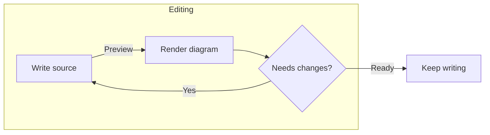
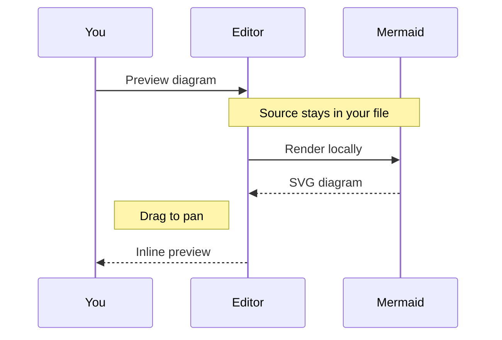

# Clear diagrams and annotations

Flat shapes, readable labels, and notes that stay legible in dark and light themes.

```mermaid
flowchart LR
    subgraph Editing
        A[Write source] -->|Preview| B[Render diagram]
        B --> C{Needs changes?}
        C -->|Yes| A
    end
    C -->|Ready| D[Keep writing]
```

## Notes and messages

```mermaid
sequenceDiagram
    participant U as You
    participant E as Editor
    participant M as Mermaid
    U->>E: Preview diagram
    Note over E,M: Source stays in your file
    E->>M: Render locally
    M-->>E: SVG diagram
    Note right of U: Drag to pan
    E-->>U: Inline preview
```
