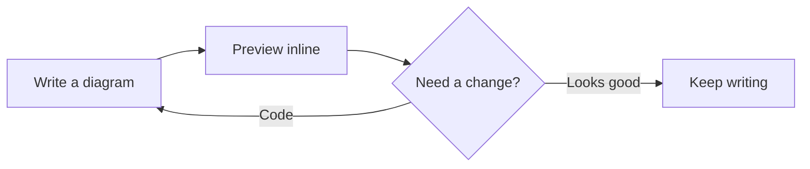
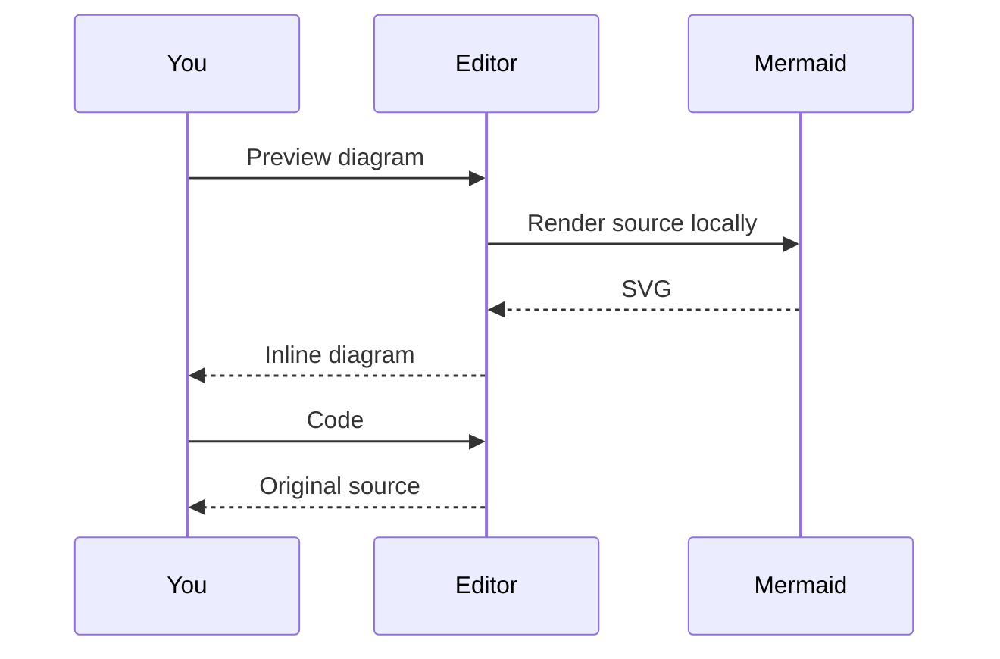

# Mermaid, where you write it

Click **Preview Mermaid diagram** above either fence, or place your cursor inside
one and press **⌥⌘M** on macOS (**Ctrl+Alt+M** on Windows/Linux).

This is ordinary, editable Markdown in VS Code's native text editor.

The Command Palette also offers **Mermaid Inline: Preview All Diagrams** and
**Mermaid Inline: Show All Source Code**.
